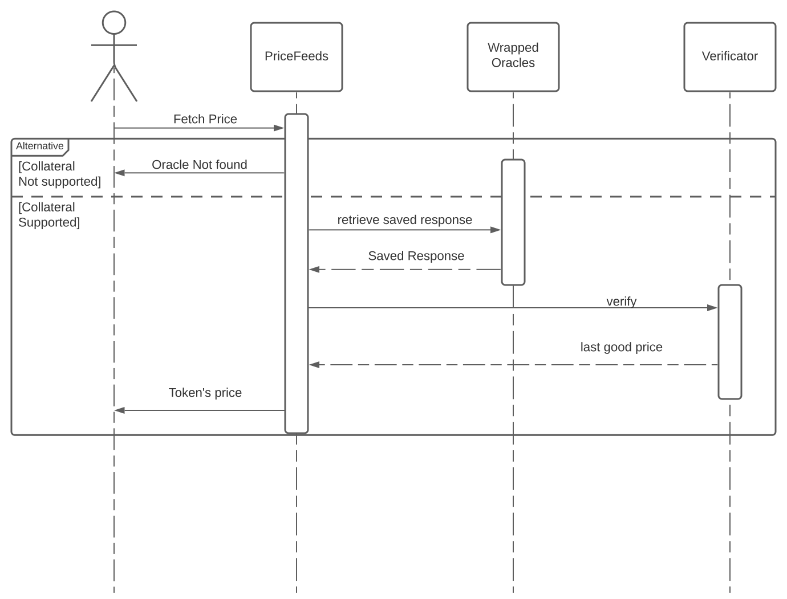

# OraclePriceFetch aka PriceFeed v2

It's used by Vesta Protocol V1, this is our wrapper system that allows us to support multiple types of oracles
easily.

### Structure

The logic behind OraclePriceFetch is based on three major contracts

1. PriceFeedV2
2. OracleWrappers
3. OracleVerificatorV1

### System Flow

#### PriceFeedV2

Is the request handler, The protocol will ask this contract to get the price value of a token

#### OracleWrappers

Each wrapper are an extentions of BaseWrapper. This is where the magic happens, we create a Oracle Wrapper to
support a specific type of External Oracle.

#### OracleVerificatorV1

Our security contract. It will verify the response of the primary and secondary oracles. Then define the "valid"
price based on our check.

## Requirements

To be eligible to our system, your oracle should have the following functions / datas [VIEW ONLY]

1. [Requried] Current Price
2. [Required] Last Price
3. [Optional but highly recommended] Last Update Time: When was the last update on the oracle.
4. [Optional] Decimals: What decimals are you using for the oracle.
